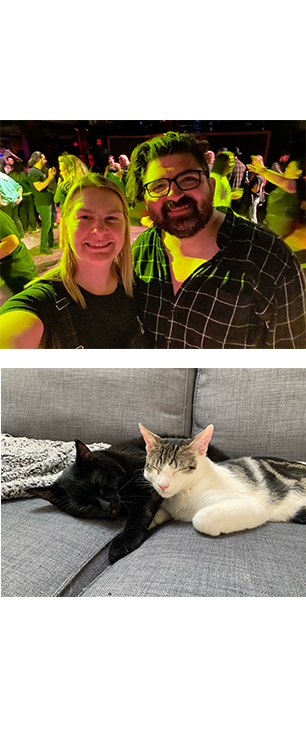
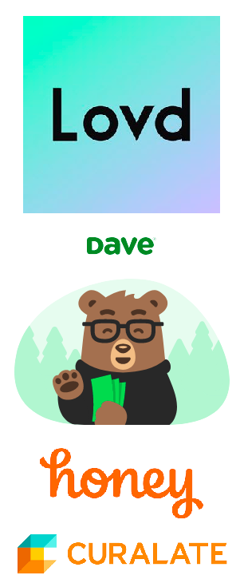

# README.lauren

Some bits of information about who I am, how I work, and how to work with me

This is meant to be digested by people that I work closely with, but in particular those who report to me

---

## About Me

- I grew up in **Pittsburgh, PA** and currently live in **Brooklyn, NY**
- I love running, spending time with family and friends, doing arts and crafts, music, and food
- My partner Billy and I have been together since college and we are getting married in October
- I love animals and have 2 cats, Binx and Pogo

---

## My Experience

- I learned how to program when I was a kid by going through tutorials on Neopets
- I went to school for Mechanical and Environmental Engineering and pivoted to software after graduation
- I've been in the industry for just over 10 years and have managed people for the last 4
- My interests lie mostly in product, UX, and the front-end, but I've always worked across the stack

---

## My Experience (cont.)

- For the last 2 years I was working on my own company (it's still around in some capacity - [Lovd.com](https://www.lovd.com/))
- I've also worked in:
  - Fintech (Dave)
  - Ecommerce & Digital Marketing (Curalate / Honey)
  - Freelance gigs all over the place

---

## Why Mercury?

1. I felt like I got a good grasp of the **People** and **Culture** during my interview process and wanted to be a part of it
2. I'm excited by the _huge_ business opportunity in front of us
3. The opportunity to learn and use Haskell was appealing - I've been working in the same stack for quite some time now
4. I wanted to join a larger company that still felt like a start-up and help it to grow even further

---

## My Role

- Attract, hire, and retain world-class talent
- Create an environment in which these talented people can do their best work by:
  - Providing a high-degree of [psychological safety](https://www.nytimes.com/2016/02/28/magazine/what-google-learned-from-its-quest-to-build-the-perfect-team.html)
  - Building and assisting in building relationships amongst the team
  - Ensuring that the work we are doing has value
- Enable amazing products to be delivered autonomously by:
  - Relaying and setting context
  - Removing as many obstacles as I can

---

## Communication

- I prefer Slack and in-person/Zoom communication 
- I like to keep things public when able to and am a big fan of (good) documentation
- I am biased toward openness and transparency
- Even when I am constrained from full transparency, I am committed to _not_ lying to you

---

## My Assumptions

- _You are much better at your job than I am_
  - I will bring questions to the table in order to build context and understanding
- _You feel safe disagreeing with and challenging me_
  - Always feel free to bring up ideas, counter arguments, and feedback - it will only help our relationship grow stronger
- _You mean well_
  - Stressful times can yield stressful conversations - I'll do my best to not take things personally

---

## Feedback

- **Range**: Positive and negative feedback is equally as important
- **Multi-directional**: Feedback is a two-way street and I encourage you to also give me feedback
- **Safety**: There should be no retaliation or punishment for giving feedback
- **Low Effort**: Feedback should be easy to deliver, with no rebuttals
- **Positive Effect**: Feedback should materially impact behaviour (be worth the effort)

---

## 1:1s

If we work closely together, we'll have a regularly-occuring 1:1

### If I am your manager, the 1:1 is _your_ time:

- My goal with 1:1s is to build trust and our working relationship, and focus on your personal development
- _Don't_ use the time for status updates if you can avoid it
- I will assume that anything we discuss is confidential, unless otherwise disclosed

---

## Need my time?

- Find me on Slack and ask for a quick chat - I don't mind context switching and might be available _right now_
- Put something on my calendar - you don't need my permission
- If something is urgent or tactical, don't wait for a 1:1

